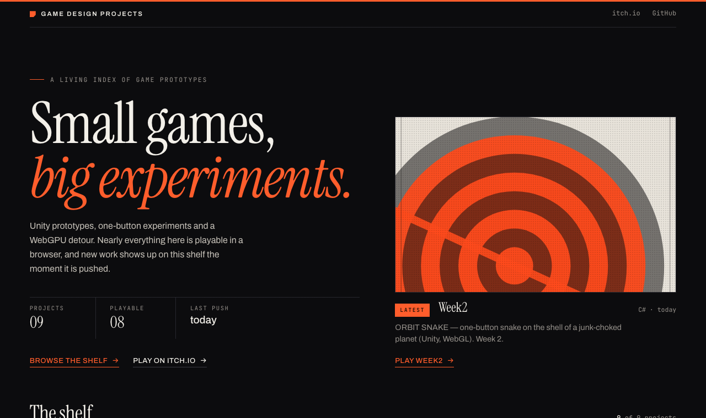

# game-design-projects.github.io

Landing page for the [game-design-projects](https://github.com/game-design-projects) GitHub org → **https://game-design-projects.github.io/**

A dependency-free static page (vanilla HTML/CSS/JS, no build step). The project list maintains itself:

1. **Live** — on load, the browser reads the org's public repos from the GitHub API.
2. **Snapshot fallback** — a workflow rewrites `data/repos.json` on every push to `main` and every 6 hours. If the live call fails (rate limit, offline) the page uses the snapshot.
3. Only **public, non-archived** repos are listed (forks included); `.github` and this repo are hidden. Private repos are never requested.

A repo's **Play** button comes from its GitHub *Website* (`homepage`) field — set it to the itch.io URL and the button appears.

## Develop

```bash
python3 -m http.server 8765      # http://localhost:8765
./scripts/build-data.sh          # refresh data/repos.json from the GitHub API
```

Debug switches: `?offline=1` (force snapshot), `?theme=light|dark`, `?view=plates|index`.

Deploy is `.github/workflows/deploy.yml` (GitHub Pages, workflow mode).
